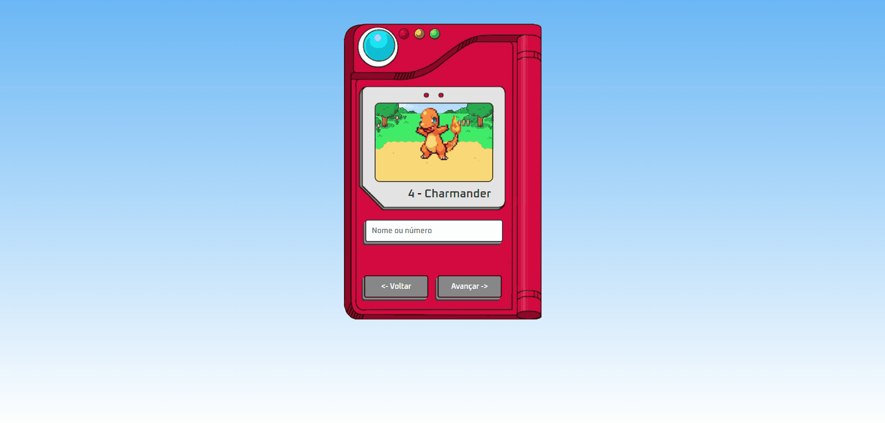
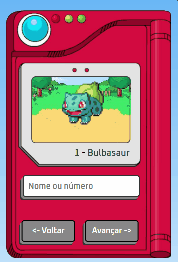

# Nome do projeto

Projeto de exemplo de pokedex que consome uma API desenvolvida no HTML, CSS e JS.

# Descrição

Projeto feito para testar minhas habilidades em HTML CSS JAVASCRIPT.
Para ter acesso a mesma API que eu utilizei no processo de prototipação desta página, acesse <a href="https://pokeapi.co/" target="_blank">POKEDEX</a>.

# Link do GitHUB pages

> [CLIQUE AQUI](https://kayothyerre.github.io/char-select-port/)

# Modo de uso

Este projeto não tem especificações de uso como outros sites que utilizamos o node version manager.

# Visualize o layout do projeto

> DESKTOP
 

>MOBILE

